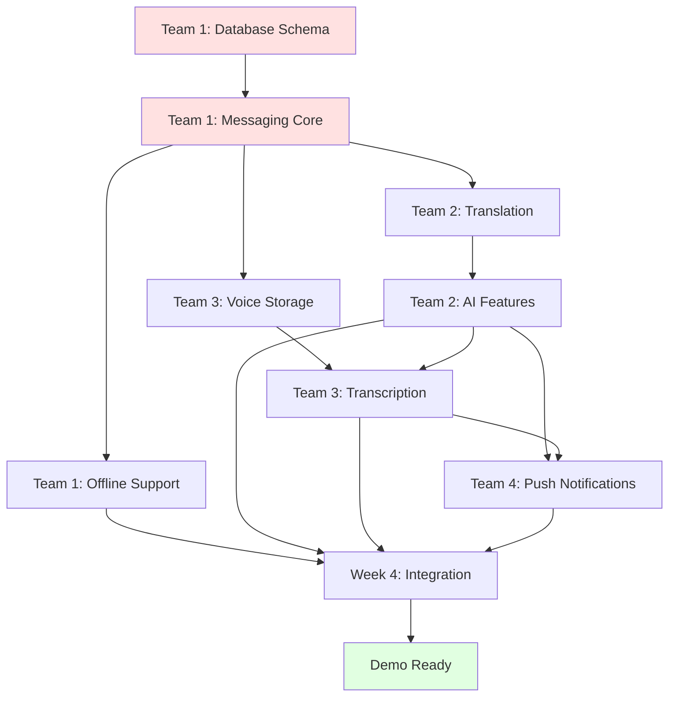

# Team Structure & Work Breakdown
## Multilingual Family Chat Application

**Version:** 1.0  
**Last Updated:** October 22, 2025  
**Project Constraint:** All teams share ONE hard drive (single git repository)

---

## Table of Contents
1. [Team Structure Overview](#1-team-structure-overview)
2. [Team Responsibilities](#2-team-responsibilities)
3. [File/Folder Ownership](#3-filefolder-ownership)
4. [Integration Points](#4-integration-points)
5. [Communication Protocols](#5-communication-protocols)
6. [Git Workflow Strategy](#6-git-workflow-strategy)
7. [Timeline & Dependencies](#7-timeline--dependencies)

---

## 1. Team Structure Overview

### 1.1 Recommended Team Configuration

Given the constraint that **all teams share one hard drive** (single repository), we organize teams by **functional domain** rather than by layer (frontend/backend). This minimizes cross-team file conflicts.

**4 Teams Total (10-12 people):**

```
Team 1: Core Messaging (3 people)
Team 2: AI Features (3 people)
Team 3: Voice & Media (2-3 people)
Team 4: Infrastructure & Polish (2-3 people)
```

Each team has:
- **1 PM/Lead:** Coordinates work, reviews PRs, manages timeline
- **1 QA:** Tests features, writes test cases, validates edge cases
- **1-2 Devs:** Implements features (fullstack - both mobile + backend)
- **Optional: 1 DBA:** If database-heavy work (Team 1 and Team 4)

### 1.2 Why This Structure?

**Key Principle:** Minimize file collisions by giving each team **clear ownership** of specific files/folders.

- ❌ **Bad:** Team 1 = Frontend, Team 2 = Backend → Both touch same features, constant merge conflicts
- ✅ **Good:** Team 1 = Messaging, Team 2 = AI → Each owns distinct files, rare conflicts

**Trade-off:** Teams must be **fullstack capable** (React Native + TypeScript + Supabase + Vercel). But this is realistic since:
- React Native and Node.js both use TypeScript
- Same language (TypeScript) across stack
- Supabase client is just JavaScript
- Team members can pair program if skill gaps exist

---

## 2. Team Responsibilities

### Team 1: Core Messaging (Foundation Team)

**Mission:** Build the basic chat functionality that everything else depends on.

**Responsibilities:**
1. **Database Schema:** Create all tables, RLS policies, indexes (in Supabase)
2. **Authentication:** Implement login/signup with Supabase Auth
3. **Real-time Messaging:** Text messages with Supabase Realtime subscriptions
4. **Read Receipts:** Track and display sent/delivered/read status
5. **Typing Indicators:** Implement with Supabase Presence
6. **Offline Support:** AsyncStorage caching and sync queue
7. **Message Editing:** Edit functionality with validation logic

**Deliverables:**
- `DATABASE_SCHEMA.sql` - Complete schema with RLS
- `mobile/src/screens/AuthScreen.tsx`
- `mobile/src/screens/ConversationListScreen.tsx`
- `mobile/src/screens/ChatScreen.tsx` (basic version)
- `mobile/src/components/ChatBubble.tsx`
- `mobile/src/components/TypingIndicator.tsx`
- `mobile/src/components/ReadReceipt.tsx`
- `mobile/src/hooks/useMessages.ts`
- `mobile/src/hooks/useTypingIndicator.ts`
- `mobile/src/lib/supabase.ts`
- `backend/api/messages/edit.ts`
- `backend/lib/supabase.ts`

**Why This Team Goes First:**
- Everyone else depends on the database schema
- Core messaging is prerequisite for all AI features
- Real-time subscriptions needed before translation updates work

---

### Team 2: AI Features (Intelligence Team)

**Mission:** Add translation, slang detection, formality adjustment, and cultural hints.

**Responsibilities:**
1. **Language Detection:** Client-side with `franc`, fallback to OpenAI
2. **Translation Pipeline:** Async translation with OpenAI GPT-4o-mini
3. **Slang Detection:** On-demand slang explanation with modal UI
4. **Formality Adjustment:** Magic wand with 3 formality options
5. **Cultural Hints:** Daily cron job + banner UI in chat
6. **Translation Toggle:** UI for switching between original and translated

**Deliverables:**
- `mobile/src/components/FormalityPicker.tsx`
- `mobile/src/components/SlangExplanationModal.tsx`
- `mobile/src/components/CulturalHintBanner.tsx`
- `mobile/src/components/TranslationToggle.tsx`
- `mobile/src/hooks/useTranslation.ts`
- `mobile/src/utils/languageDetection.ts`
- `backend/api/webhook/message-created.ts`
- `backend/api/webhook/message-edited.ts`
- `backend/api/adjust-formality.ts`
- `backend/api/explain-slang.ts`
- `backend/api/cron/cultural-hints.ts`
- `backend/lib/openai.ts`
- `backend/lib/translation.ts`
- `backend/lib/slang-detection.ts`
- `backend/lib/cultural-hints.ts`

**Dependencies:**
- Waits for Team 1 to complete database schema and basic messaging
- Waits for Team 1 to implement webhook triggers

**Why Separate from Team 1:**
- AI features are complex and can be developed in parallel once messaging works
- OpenAI integration is distinct from real-time messaging
- Minimal file overlap with Team 1 (different components, different backend files)

---

### Team 3: Voice & Media (Multimedia Team)

**Mission:** Handle voice messages, audio recording, transcription, and storage.

**Responsibilities:**
1. **Voice Recording:** UI for tap-and-hold recording with waveform
2. **Audio Upload:** Upload to Supabase Storage
3. **Transcription:** Whisper API integration
4. **Voice Playback:** Audio player UI component
5. **Voice Translation:** Apply translation to transcription
6. **Storage Management:** Supabase Storage bucket setup and RLS

**Deliverables:**
- `mobile/src/components/VoiceRecorder.tsx`
- `mobile/src/components/VoicePlayer.tsx`
- `mobile/src/hooks/useVoiceRecorder.ts`
- `backend/api/transcribe-voice.ts`
- `backend/lib/transcription.ts`
- Supabase Storage bucket configuration (`voice-memos`)
- Storage RLS policies

**Dependencies:**
- Waits for Team 1 to complete basic messaging (voice messages are just special messages)
- Waits for Team 2 to complete translation pipeline (voice transcriptions get translated)

**Why Separate from Teams 1 & 2:**
- Voice is a distinct feature set (recording, storage, transcription)
- Can be developed in parallel once basic messaging is stable
- Limited file overlap (new components, new backend endpoint)

---

### Team 4: Infrastructure & Polish (Enablement Team)

**Mission:** Handle deployment, monitoring, UI polish, dark mode, settings, and integration testing.

**Responsibilities:**
1. **Deployment Setup:** Vercel deployment, environment variables, Supabase setup
2. **Dark Mode:** Theme system with light/dark/system options
3. **Settings Screen:** User preferences, language selection, logout
4. **Push Notifications:** Expo Push integration and backend triggers
5. **Error Handling:** User-friendly error messages and retry logic
6. **Performance Optimization:** Message list virtualization, caching
7. **Integration Testing:** End-to-end testing of all features
8. **Demo Prep:** Seed data, test accounts, video recording

**Deliverables:**
- `mobile/src/contexts/ThemeContext.tsx`
- `mobile/src/screens/SettingsScreen.tsx`
- `mobile/src/constants/theme.ts`
- `backend/lib/notifications.ts`
- `backend/utils/errors.ts`
- `backend/vercel.json` (Vercel configuration)
- `infrastructure/supabase/migrations/` (migration scripts)
- `.env.example` (environment variable template)
- `README.md` (setup instructions)
- Demo video and test data

**Dependencies:**
- Waits for all teams to complete core features
- Works in parallel with other teams for infrastructure setup
- Final integration testing happens at the end

**Why This Team:**
- Infrastructure work spans all teams (deployment affects everyone)
- Polish and testing require all features to be complete
- Handles cross-cutting concerns (themes, settings, errors)

---

## 3. File/Folder Ownership

### 3.1 Repository Structure

```
project-root/
├── mobile/                      # React Native app
│   ├── src/
│   │   ├── components/          # UI components
│   │   │   ├── ChatBubble.tsx           [Team 1]
│   │   │   ├── TypingIndicator.tsx      [Team 1]
│   │   │   ├── ReadReceipt.tsx          [Team 1]
│   │   │   ├── FormalityPicker.tsx      [Team 2]
│   │   │   ├── SlangExplanationModal.tsx [Team 2]
│   │   │   ├── CulturalHintBanner.tsx   [Team 2]
│   │   │   ├── TranslationToggle.tsx    [Team 2]
│   │   │   ├── VoiceRecorder.tsx        [Team 3]
│   │   │   └── VoicePlayer.tsx          [Team 3]
│   │   ├── screens/             # Screen components
│   │   │   ├── AuthScreen.tsx           [Team 1]
│   │   │   ├── ConversationListScreen.tsx [Team 1]
│   │   │   ├── ChatScreen.tsx           [Team 1 base, Teams 2&3 extend]
│   │   │   └── SettingsScreen.tsx       [Team 4]
│   │   ├── hooks/               # Custom hooks
│   │   │   ├── useMessages.ts           [Team 1]
│   │   │   ├── useTypingIndicator.ts    [Team 1]
│   │   │   ├── useTranslation.ts        [Team 2]
│   │   │   └── useVoiceRecorder.ts      [Team 3]
│   │   ├── contexts/            # React contexts
│   │   │   ├── AuthContext.tsx          [Team 1]
│   │   │   └── ThemeContext.tsx         [Team 4]
│   │   ├── lib/                 # External clients
│   │   │   ├── supabase.ts              [Team 1]
│   │   │   └── api.ts                   [Team 4]
│   │   ├── utils/               # Helper functions
│   │   │   ├── languageDetection.ts     [Team 2]
│   │   │   └── dateFormatting.ts        [Team 4]
│   │   ├── types/               # TypeScript types
│   │   │   ├── database.types.ts        [Team 1 generates]
│   │   │   └── api.types.ts             [Shared - all teams]
│   │   └── constants/
│   │       └── theme.ts                 [Team 4]
│   ├── App.tsx                          [Team 4 - root component]
│   └── package.json                     [Team 4 - manages dependencies]
│
├── backend/                     # Vercel serverless functions
│   ├── api/
│   │   ├── webhook/
│   │   │   ├── message-created.ts       [Team 2]
│   │   │   └── message-edited.ts        [Team 2]
│   │   ├── messages/
│   │   │   └── edit.ts                  [Team 1]
│   │   ├── transcribe-voice.ts          [Team 3]
│   │   ├── adjust-formality.ts          [Team 2]
│   │   ├── explain-slang.ts             [Team 2]
│   │   └── cron/
│   │       └── cultural-hints.ts        [Team 2]
│   ├── lib/
│   │   ├── supabase.ts                  [Team 1]
│   │   ├── openai.ts                    [Team 2]
│   │   ├── translation.ts               [Team 2]
│   │   ├── transcription.ts             [Team 3]
│   │   ├── slang-detection.ts           [Team 2]
│   │   ├── cultural-hints.ts            [Team 2]
│   │   └── notifications.ts             [Team 4]
│   ├── utils/
│   │   ├── validation.ts                [Team 4]
│   │   └── errors.ts                    [Team 4]
│   ├── types/
│   │   ├── database.types.ts            [Team 1 generates]
│   │   └── api.types.ts                 [Shared - all teams]
│   ├── vercel.json                      [Team 4]
│   └── package.json                     [Team 4]
│
├── infrastructure/              # Database & deployment
│   └── supabase/
│       └── migrations/
│           ├── 001_initial_schema.sql   [Team 1]
│           ├── 002_rls_policies.sql     [Team 1]
│           ├── 003_triggers.sql         [Team 1]
│           └── 004_storage.sql          [Team 3]
│
├── docs/                        # Documentation
│   ├── PRD.md                           [Team 4]
│   ├── DATABASE_SCHEMA.md               [Team 1]
│   ├── TECHNICAL_ARCHITECTURE.md        [Team 4]
│   ├── API_SPECIFICATION.md             [Team 4]
│   └── UI_UX_SPECIFICATION.md           [Team 4]
│
├── .env.example                         [Team 4]
├── .gitignore                           [Team 4]
├── README.md                            [Team 4]
└── package.json (root)                  [Team 4]
```

### 3.2 Ownership Rules

**Strict Ownership (One team only):**
- Each team "owns" specific files
- Only the owning team can modify owned files
- Other teams must request changes via the owning team's PM

**Shared Files (Require coordination):**
- `mobile/src/types/api.types.ts` - All teams add their types
- `mobile/src/screens/ChatScreen.tsx` - Team 1 creates base, Teams 2 & 3 extend
- `backend/types/api.types.ts` - All teams add their types

**Conflict Resolution:**
- If two teams need to modify the same file, use **feature branches**
- PM from each team coordinates merge
- One team merges first, other team rebases

---

## 4. Integration Points

### 4.1 Team 1 → Team 2 Integration

**What Team 2 Needs from Team 1:**
1. Database schema complete (messages, message_translations tables)
2. Webhook triggers set up (on message INSERT/UPDATE)
3. Basic ChatScreen component with message list
4. Supabase client configured

**Integration Flow:**
```
Team 1 completes:
  - Database schema
  - Webhook trigger: notify_new_message()
  
Team 2 implements:
  - Webhook handler: /api/webhook/message-created
  - Translation logic
  - UI components for translation toggle
  
Integration point:
  - Team 2 adds TranslationToggle component to Team 1's ChatBubble
  - Team 1 reviews PR, ensures no conflicts
```

**Communication:**
- Team 1 PM notifies Team 2 PM when schema is deployed
- Team 2 PM notifies Team 1 PM when translation components are ready
- Joint testing session to verify webhook → translation → UI flow

---

### 4.2 Team 1 → Team 3 Integration

**What Team 3 Needs from Team 1:**
1. Messages table with `message_type`, `voice_url`, `voice_duration_seconds`
2. Basic message sending flow
3. Supabase Storage setup (Team 3 does this, but needs Team 1's schema first)

**Integration Flow:**
```
Team 1 completes:
  - Messages table with voice fields
  - Basic message INSERT flow
  
Team 3 implements:
  - VoiceRecorder component
  - Supabase Storage upload
  - Whisper transcription endpoint
  
Integration point:
  - Team 3 adds VoiceRecorder button to Team 1's compose area
  - Team 3 adds VoicePlayer to Team 1's message bubble
  - Team 1 reviews PR
```

**Communication:**
- Team 1 PM confirms voice message fields are in schema
- Team 3 PM notifies when voice components are ready for integration

---

### 4.3 Team 2 → Team 3 Integration

**What Team 3 Needs from Team 2:**
1. Translation pipeline to handle voice transcriptions
2. `message_translations` table

**Integration Flow:**
```
Team 2 completes:
  - Translation logic
  
Team 3 implements:
  - Voice transcription
  - After transcription, triggers Team 2's translation pipeline
  
Integration point:
  - Team 3's transcribe-voice.ts calls Team 2's processMessage()
  - OR Team 3 updates message.content, Team 2's webhook handles it
```

**Communication:**
- Team 2 PM shares translation logic interface/API
- Team 3 uses it after transcription completes

---

### 4.4 Team 4 → All Teams Integration

**What Team 4 Provides to Everyone:**
1. Theme system (all teams use ThemeContext)
2. Error handling utilities (all teams use standardized errors)
3. Deployment configuration (affects all teams)
4. Push notification library (Teams 1 & 2 trigger notifications)

**Integration Flow:**
```
Team 4 sets up (Week 1):
  - ThemeContext
  - Error utilities
  - Vercel config
  
All teams use (Weeks 2-4):
  - Import ThemeContext in components
  - Use error utilities in backend
  - Deploy to Vercel
```

**Communication:**
- Team 4 PM announces when infrastructure is ready (Slack/Discord)
- All teams attend integration meeting (Week 2 start)

---

## 5. Communication Protocols

### 5.1 Daily Standups (Async)

**Format:** Slack/Discord thread per team, posted by 10am daily

**Template:**
```
Team [X] Standup - [Date]
================================
[Member 1]
  Yesterday: Implemented voice recording UI
  Today: Integrate Whisper API
  Blockers: Waiting for Team 2's translation interface

[Member 2]
  Yesterday: Set up Supabase Storage bucket
  Today: Implement RLS policies for voice-memos
  Blockers: None

[PM]
  Team Status: On track for Week 3 milestone
  Dependencies: Team 2 - need translation API docs by EOD
```

### 5.2 Weekly Integration Sync (Live)

**Schedule:** Friday 3pm, 30 minutes, all PMs + optional devs

**Agenda:**
1. Review cross-team dependencies
2. Resolve merge conflicts
3. Plan next week's integration points
4. Demo completed features

### 5.3 PR Review Protocol

**Rules:**
1. **Own files:** Team PM must approve (1 approval needed)
2. **Shared files:** Both team PMs must approve (2 approvals needed)
3. **Max review time:** 24 hours (if not reviewed, auto-ping PM)

**PR Template:**
```
## Team: [Team X]
## Feature: [Feature Name]
## Affects Teams: [Team Y, Team Z]

### Changes:
- [List changes]

### Testing:
- [How to test]

### Screenshots/Video:
- [If UI changes]

### Dependencies:
- [Any blocked PRs or features]
```

### 5.4 Conflict Resolution

**Merge Conflict Process:**
1. Developer notices conflict
2. Developer notifies both team PMs (Slack)
3. PMs hop on quick call (15 min)
4. Decide: rebase or merge strategy
5. PM from one team performs merge, documents decision

---

## 6. Git Workflow Strategy

### 6.1 Branch Strategy

**Main Branches:**
- `main` - Production-ready code (protected, requires PR)
- `develop` - Integration branch (all PRs merge here first)

**Feature Branches:**
- `team1/auth-screen` - Team 1's auth screen feature
- `team2/translation-pipeline` - Team 2's translation feature
- `team3/voice-recording` - Team 3's voice recording feature
- `team4/dark-mode` - Team 4's dark mode feature

**Branch Naming Convention:**
```
team[X]/[feature-name]
```

Examples:
- `team1/edit-message`
- `team2/slang-detection`
- `team3/whisper-integration`
- `team4/push-notifications`

### 6.2 Merge Flow

```
Feature Branch → develop → main
```

**Process:**
1. Developer works on `team[X]/[feature]` branch
2. When ready, opens PR to `develop`
3. Team PM reviews and approves
4. Merge to `develop`
5. At end of week, Team 4 PM merges `develop` → `main` (after integration testing)

### 6.3 Avoiding Conflicts

**Strategy 1: Strict File Ownership**
- Each team owns specific files
- Minimal overlap = minimal conflicts

**Strategy 2: Integration Files Go Last**
- Shared files (like `ChatScreen.tsx`) modified in **integration phase** (Week 4)
- Teams work on isolated components first (Weeks 2-3)

**Strategy 3: Frequent Rebasing**
- Teams rebase their feature branches on `develop` daily
- Catches conflicts early

**Example Daily Workflow:**
```bash
# Morning: Sync with develop
git checkout team2/translation
git fetch origin
git rebase origin/develop

# If conflicts:
git status  # See conflicting files
# Fix conflicts
git add .
git rebase --continue

# Evening: Push progress
git push origin team2/translation --force-with-lease
```

### 6.4 Protected Files (Require Coordination)

**Files that need extra care:**
```
mobile/src/screens/ChatScreen.tsx
mobile/src/types/api.types.ts
backend/types/api.types.ts
package.json (both mobile/ and backend/)
```

**Protocol for modifying protected files:**
1. Open discussion in #integration-chat Slack channel
2. Propose change
3. Get buy-in from affected teams
4. One person makes change, others rebase

---

## 7. Timeline & Dependencies

### 7.1 4-Week Sprint Plan

```
Week 1: Foundation
├── Team 1: Database schema, auth, basic messaging [CRITICAL PATH]
├── Team 2: OpenAI client setup, language detection POC
├── Team 3: Voice recording UI prototype
└── Team 4: Vercel + Supabase setup, theme system

Week 2: Core Features
├── Team 1: Read receipts, typing indicators, message editing [BLOCKER for Teams 2&3]
├── Team 2: Translation pipeline (depends on Team 1 schema) ⏳
├── Team 3: Voice upload + storage (depends on Team 1 schema) ⏳
└── Team 4: Settings screen, error handling

Week 3: AI & Voice
├── Team 1: Offline support, optimize real-time
├── Team 2: Slang detection, formality, cultural hints (depends on Team 1 webhooks) ⏳
├── Team 3: Whisper transcription, voice translation (depends on Team 2 translation) ⏳⏳
└── Team 4: Push notifications, performance tuning

Week 4: Integration & Polish
├── All Teams: Integration testing
├── Team 1: Bug fixes
├── Team 2: Bug fixes
├── Team 3: Bug fixes
└── Team 4: Demo prep, video, documentation
```

**Legend:**
- [CRITICAL PATH] - Blocks other teams
- [BLOCKER for X] - X team waiting on this
- ⏳ - Depends on 1 other team
- ⏳⏳ - Depends on 2 other teams

### 7.2 Dependency Graph



### 7.3 Risk Mitigation

**Risk 1: Team 1 delayed → Everyone blocked**

**Mitigation:**
- Team 1 gets extra resources (most experienced devs)
- Team 1 works in pairs to go faster
- Daily check-ins with Team 1 PM

**Risk 2: Merge conflicts in Week 4**

**Mitigation:**
- Teams rebase daily
- Strict file ownership
- Integration testing starts in Week 3 (not waiting until Week 4)

**Risk 3: OpenAI API issues**

**Mitigation:**
- Team 2 builds mock translation first (returns fake translations)
- Switch to real API once mock works
- If API down during demo, use video backup

**Risk 4: Team 3 blocked by Team 2**

**Mitigation:**
- Team 3 builds voice recording/playback first (doesn't need translation)
- Team 3 uses mock translation until Team 2 ready
- Transcription can work without translation (just show English transcription)

---

## 8. Example: Day-in-the-Life

### Team 1 Developer (Sarah) - Week 2, Wednesday

**Morning (9am - 12pm):**
```
9:00am - Check Slack: Team 2 needs webhook trigger deployed
9:15am - Pull latest develop branch
9:20am - Create feature branch: team1/webhook-triggers
9:30am - Write SQL trigger: notify_new_message()
10:00am - Test locally with Supabase CLI
10:30am - Deploy to Supabase staging environment
11:00am - Notify Team 2 PM: "Webhook trigger deployed to staging"
11:15am - Start implementing message edit validation
12:00pm - Lunch
```

**Afternoon (1pm - 5pm):**
```
1:00pm - Resume edit validation work
2:00pm - Open PR: "Add message edit endpoint with validation"
2:15pm - Request review from Team 1 PM
3:00pm - Team 2 dev messages: "Webhook working, but missing user_id in payload"
3:15pm - Quick fix: Add user_id to webhook payload
3:30pm - Push fix, notify Team 2
4:00pm - Team 1 PM approves PR
4:15pm - Merge to develop
4:30pm - Update standup doc for tomorrow
5:00pm - EOD
```

### Team 2 Developer (Alex) - Week 2, Wednesday

**Morning (9am - 12pm):**
```
9:00am - Check Slack: Team 1 deployed webhook trigger 🎉
9:15am - Pull latest develop
9:20am - Create branch: team2/translation-pipeline
9:30am - Implement /api/webhook/message-created endpoint
10:00am - Add OpenAI translation call
10:30am - Test with mock webhook payload
11:00am - Notice missing user_id in webhook - message Team 1
11:30am - Team 1 fixes, re-test
12:00pm - Lunch
```

**Afternoon (1pm - 5pm):**
```
1:00pm - Continue translation pipeline
2:00pm - Add caching logic (check message_translations first)
3:00pm - Implement push notification after translation
3:30pm - Test end-to-end: message insert → webhook → translate → notify
4:00pm - Success! Record demo video
4:30pm - Open PR: "Translation pipeline MVP"
5:00pm - EOD
```

### Team 3 Developer (Jordan) - Week 2, Wednesday

**Morning (9am - 12pm):**
```
9:00am - Check Slack: Team 1 schema deployed, can start voice work
9:15am - Pull latest develop
9:20am - Create branch: team3/voice-recorder
9:30am - Implement VoiceRecorder.tsx component
10:30am - Add waveform animation
11:30am - Test recording on iOS simulator
12:00pm - Lunch
```

**Afternoon (1pm - 5pm):**
```
1:00pm - Set up Supabase Storage bucket: voice-memos
1:30pm - Add RLS policies for voice storage
2:00pm - Implement upload logic
3:00pm - Test upload to Supabase Storage
3:30pm - Blocked: Need Team 2's translation done before voice translation works
3:45pm - Decision: Build voice playback UI while waiting
4:30pm - Open PR: "Voice recording + upload (no transcription yet)"
5:00pm - EOD
```

---

## Summary

### Key Takeaways for Team Collaboration

✅ **Strict File Ownership:** Each team owns specific files, minimizing conflicts

✅ **Functional Teams:** Teams organized by feature domain (messaging, AI, voice) not layers (frontend, backend)

✅ **Clear Dependencies:** Team 1 is the critical path, everyone knows who they're waiting on

✅ **Frequent Communication:** Daily async standups + weekly live sync

✅ **Rebase Early, Rebase Often:** Catch conflicts early, don't wait until Week 4

✅ **Integration Phase:** Week 4 dedicated to tying everything together

### Team Responsibilities Recap

| Team | Focus | Critical Deliverables |
|------|-------|----------------------|
| Team 1 | Core Messaging | Database schema, real-time, editing |
| Team 2 | AI Features | Translation, slang, formality, cultural hints |
| Team 3 | Voice & Media | Recording, transcription, playback |
| Team 4 | Infrastructure | Deployment, themes, settings, testing |

### Final Advice

**For PMs:**
- Overcommunicate dependencies
- Review PRs within 24 hours
- Escalate blockers immediately

**For Developers:**
- Rebase on `develop` daily
- Don't modify files you don't own
- Ask before touching shared files

**For QA:**
- Test in isolation first (your team's feature)
- Then test integration (with other teams' features)
- Document test cases in shared doc

**For Everyone:**
- One repo, four teams
- Clear ownership = fewer conflicts
- Ship working software every week

---

**End of Team Structure & Work Breakdown**
