# UI/UX Specification
## Multilingual Family Chat Application

**Version:** 1.0  
**Last Updated:** October 22, 2025  

---

## Table of Contents
1. [System Architecture Diagram](#1-system-architecture-diagram)
2. [User Flow Diagrams](#2-user-flow-diagrams)
3. [Screen Wireframes with User Flows](#3-screen-wireframes-with-user-flows)
4. [Component Hierarchy](#4-component-hierarchy)
5. [Design System](#5-design-system)

---

## 1. System Architecture Diagram

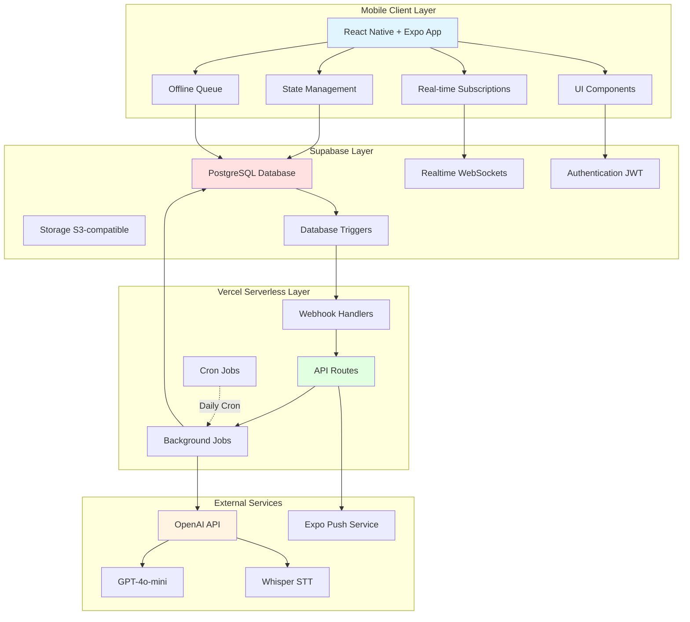

**Architecture Layers:**

1. **Mobile Client:** React Native app with optimistic UI and offline support
2. **Supabase:** Managed PostgreSQL with real-time, auth, and storage
3. **Vercel Serverless:** API endpoints and background processing
4. **External Services:** OpenAI for AI features, Expo for push notifications

**Data Flow:**
- User action → Optimistic UI → Supabase insert → Trigger webhook → Vercel processes → OpenAI API → Update database → Push notification

---

## 2. User Flow Diagrams

### 2.1 Authentication Flow

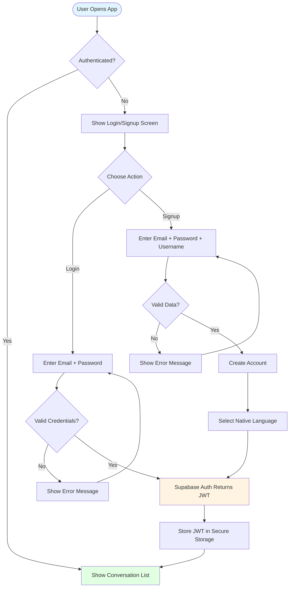

### 2.2 Send Text Message Flow

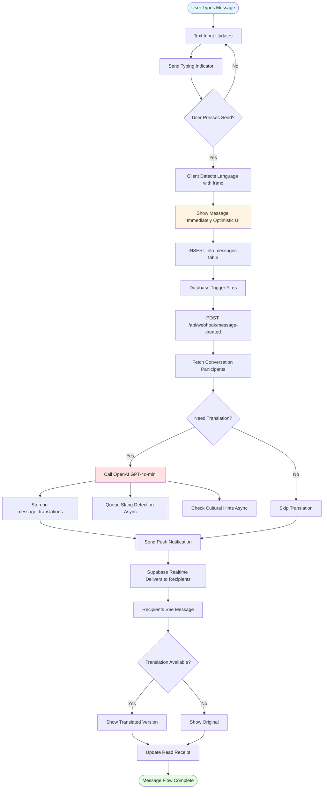

### 2.3 Send Voice Message Flow

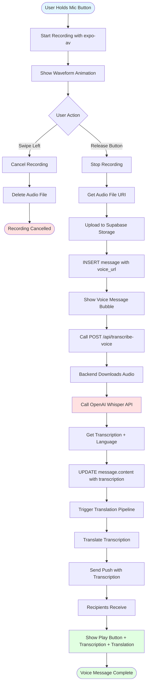

### 2.4 Edit Message Flow

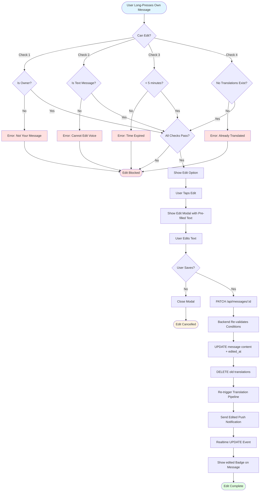

### 2.5 Slang Explanation Flow

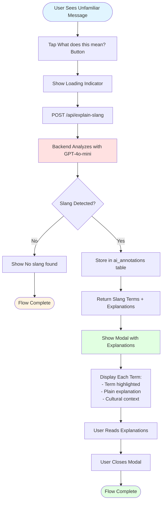

### 2.6 Formality Adjustment Flow

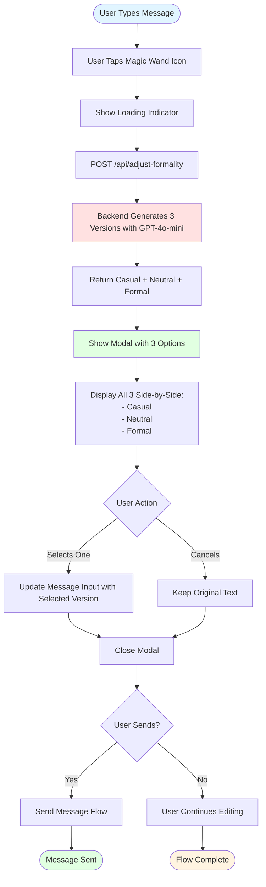

### 2.7 Cultural Hints Flow

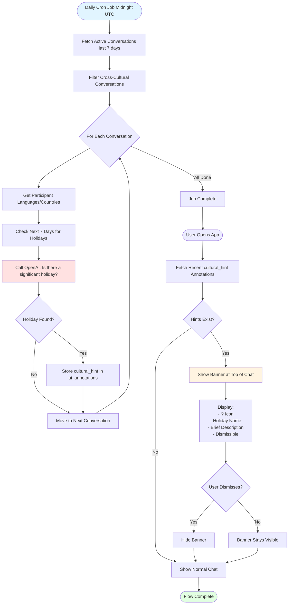

---

## 3. Screen Wireframes with User Flows

### 3.1 Conversation List Screen

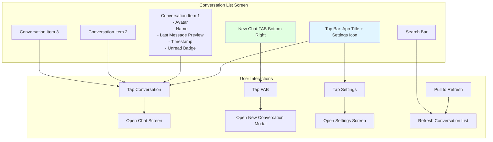

**Wireframe Description:**
```
┌─────────────────────────────────────┐
│  Family Chat          [Settings ⚙️] │
├─────────────────────────────────────┤
│  🔍 Search conversations...          │
├─────────────────────────────────────┤
│  👤 Grandma Maria             (2)   │
│  Gracias! See you tomorrow           │
│  10:30 AM                            │
├─────────────────────────────────────┤
│  👥 Family Group                    │
│  Alice: Sounds good!                 │
│  Yesterday                           │
├─────────────────────────────────────┤
│  👤 Uncle Bob                        │
│  No problem                          │
│  Oct 20                              │
├─────────────────────────────────────┤
│                                      │
│                      [➕ New Chat]   │
└─────────────────────────────────────┘
```

### 3.2 Chat Screen

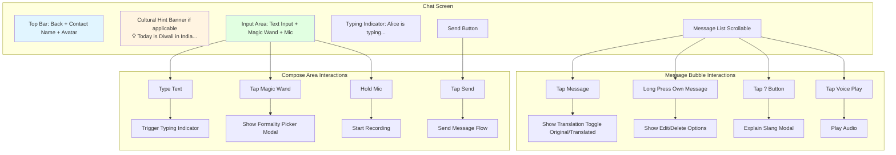

**Wireframe Description:**
```
┌─────────────────────────────────────┐
│ ← Grandma Maria        👤           │
├─────────────────────────────────────┤
│ 💡 Today is Día de los Muertos in   │
│    Mexico... [Dismiss ✕]            │
├─────────────────────────────────────┤
│                                      │
│  ┌──────────────────────┐           │
│  │ Hola! ¿Cómo estás?   │           │
│  │ 10:30 AM        ✓✓   │           │
│  └──────────────────────┘           │
│  [Translation: Hi! How are you?]    │
│  [? Explain slang]                  │
│                                      │
│           ┌──────────────────────┐  │
│           │ I'm good, thanks!    │  │
│           │ 10:32 AM        ✓    │  │
│           └──────────────────────┘  │
│           [Traducción: ¡Estoy...]   │
│           [edited]                  │
│                                      │
│  ┌─ Voice Message ─────────┐        │
│  │ [▶️ Play] 0:45          │        │
│  │ Transcription: Let me... │        │
│  │ Translation: Déjame...   │        │
│  └─────────────────────────┘        │
│                                      │
│  Alice is typing...                 │
├─────────────────────────────────────┤
│ [Type a message...] [✨] [🎤]  [➤] │
└─────────────────────────────────────┘
```

### 3.3 Settings Screen

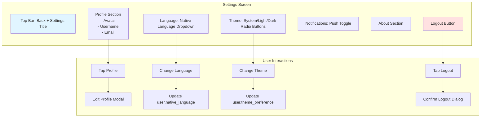

**Wireframe Description:**
```
┌─────────────────────────────────────┐
│ ← Settings                           │
├─────────────────────────────────────┤
│                                      │
│  ┌─────────────────────────────┐    │
│  │    👤                        │    │
│  │    Alex Johnson              │    │
│  │    alex@example.com          │    │
│  │    [Edit Profile]            │    │
│  └─────────────────────────────┘    │
│                                      │
│  Language                            │
│  [English ▼]                         │
│                                      │
│  Theme                               │
│  ○ System Default                    │
│  ○ Light                             │
│  ● Dark                              │
│                                      │
│  Notifications                       │
│  Push Notifications     [ON]         │
│                                      │
│  About                               │
│  Version 1.0.0                       │
│  Terms of Service                    │
│  Privacy Policy                      │
│                                      │
│  [Logout]                            │
│                                      │
└─────────────────────────────────────┘
```

### 3.4 Formality Picker Modal

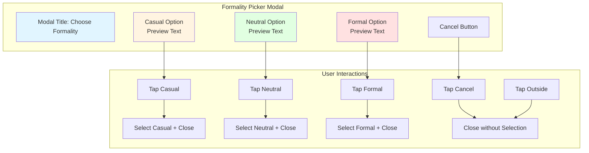

**Wireframe Description:**
```
┌─────────────────────────────────────┐
│  Choose Formality Level              │
├─────────────────────────────────────┤
│                                      │
│  😊 Casual                           │
│  ┌─────────────────────────────┐    │
│  │ Hey! Can you send that over? │    │
│  └─────────────────────────────┘    │
│                                      │
│  😐 Neutral                          │
│  ┌─────────────────────────────┐    │
│  │ Hello, could you please send │    │
│  │ that?                         │    │
│  └─────────────────────────────┘    │
│                                      │
│  🎩 Formal                           │
│  ┌─────────────────────────────┐    │
│  │ Good afternoon, would you    │    │
│  │ kindly send that document?   │    │
│  └─────────────────────────────┘    │
│                                      │
│           [Cancel]                   │
└─────────────────────────────────────┘
```

### 3.5 Slang Explanation Modal

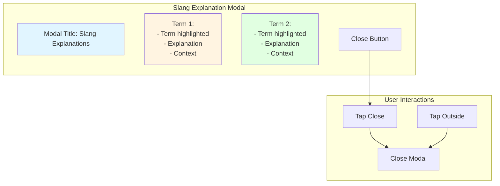

**Wireframe Description:**
```
┌─────────────────────────────────────┐
│  Slang Explanations           [✕]   │
├─────────────────────────────────────┤
│                                      │
│  "no cap"                            │
│  ┌─────────────────────────────┐    │
│  │ Means: no lie, for real      │    │
│  │ Context: Gen Z slang, used   │    │
│  │ to emphasize truthfulness    │    │
│  └─────────────────────────────┘    │
│                                      │
│  "fr fr"                             │
│  ┌─────────────────────────────┐    │
│  │ Means: for real for real     │    │
│  │ (emphasis)                    │    │
│  │ Context: Internet slang,     │    │
│  │ repetition adds emphasis      │    │
│  └─────────────────────────────┘    │
│                                      │
│           [Got it]                   │
└─────────────────────────────────────┘
```

---

## 4. Component Hierarchy

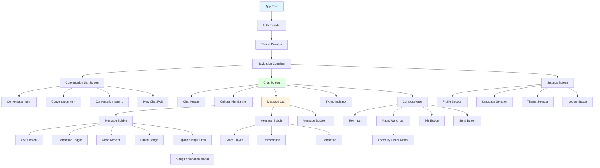

---

## 5. Design System

### 5.1 Color Palette

**Light Mode:**
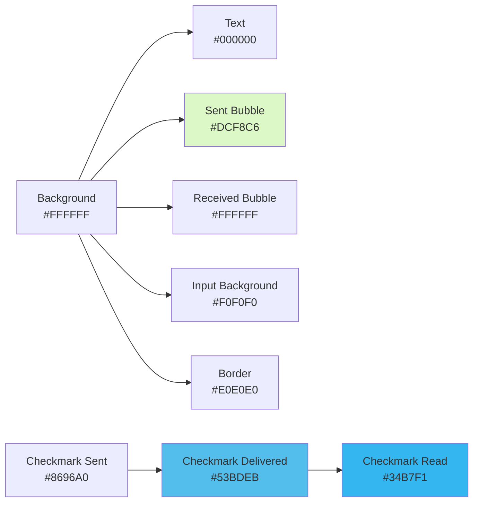

**Dark Mode:**
```mermaid
graph LR
    A[Background<br/>#0B141A] --> B[Text<br/>#E9EDEF]
    A --> C[Sent Bubble<br/>#005C4B]
    A --> D[Received Bubble<br/>#1F2C34]
    A --> E[Input Background<br/>#2A3942]
    A --> F[Border<br/>#2A3942]
    
    G[Checkmark Sent<br/>#8696A0] --> H[Checkmark Delivered<br/>#53BDEB]
    H --> I[Checkmark Read<br/>#34B7F1]
    
    style A fill:#0B141A
    style B fill:#E9EDEF
    style C fill:#005C4B
    style D fill:#1F2C34
```

### 5.2 Typography

**Font Stack:**
- System Font (iOS: San Francisco, Android: Roboto)
- Font Sizes:
  - Headers: 20px
  - Body: 16px
  - Secondary: 14px
  - Caption: 12px

### 5.3 Spacing

**Spacing Scale:**
- xs: 4px
- sm: 8px
- md: 16px
- lg: 24px
- xl: 32px

### 5.4 Component States

```mermaid
stateDiagram-v2
    [*] --> Default
    Default --> Hover: Mouse Over / Touch Down
    Hover --> Active: Click / Tap
    Active --> Loading: Processing
    Loading --> Success: Complete
    Loading --> Error: Failed
    Success --> Default: Return
    Error --> Default: Retry
    
    Default --> Disabled: Condition Not Met
    Disabled --> Default: Condition Met
```

### 5.5 Animation Guidelines

**Timing:**
- Fast: 150ms (button press, toggle)
- Medium: 300ms (modal open/close, navigation)
- Slow: 500ms (page transitions)

**Easing:**
- Ease-out: For elements entering
- Ease-in: For elements exiting
- Ease-in-out: For elements moving

---

## Summary

This UI/UX specification provides:
- ✅ **System architecture diagram** showing all layers and connections
- ✅ **Comprehensive user flows** for all major features
- ✅ **Screen wireframes** with interaction points
- ✅ **Component hierarchy** for frontend structure
- ✅ **Design system** with colors, typography, and spacing

**Key Flows Documented:**
1. Authentication (Login/Signup)
2. Send Text Message (with translation)
3. Send Voice Message (with transcription)
4. Edit Message (with validation)
5. Slang Explanation (on-demand)
6. Formality Adjustment (magic wand)
7. Cultural Hints (daily cron + banner)

**Screens Defined:**
1. Conversation List
2. Chat Screen
3. Settings Screen
4. Formality Picker Modal
5. Slang Explanation Modal

---

**End of UI/UX Specification**
